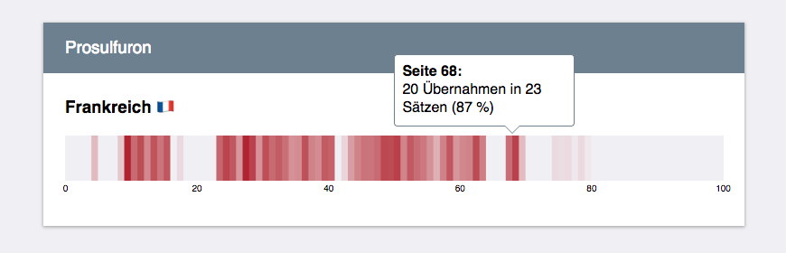
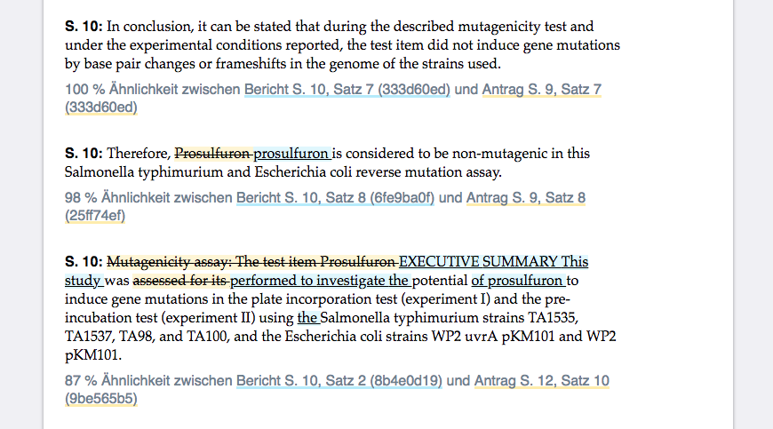

# EU-Pestizidzulassungen

Sammlung an Skripten, um die Unabhängigkeit des Pestizidzulassungsverfahrens auf EU-Ebene zu untersuchen. Analysiert wurden jeweils Herstelleranträge und Bewertungsberichte zu [25 verschiedenen Pestizidwirkstoffen](https://eur-lex.europa.eu/LexUriServ/LexUriServ.do?uri=OJ:L:2010:322:0010:0019:DE:PDF), deren Zulassungen in den vergangenen Jahren verlängert wurden.

Verglichen wurden jeweils die Textabschnitte zum Thema Toxikologie, insgesamt rund 7.500 Seiten. Die Darstellung der Suchergebnisse als Strichcode-Diagramm hilft dabei kritische Dokumente und Textpassagen zu identifizieren. Als Übernahme werden Sätze gewertet, die zu mindestens 75 Prozent mit einem Satz aus dem Herstellerantrag übereinstimmen und eine bestimmte Mindestlänge haben.

Besonders kritisch sind Textstellen, in denen die Behörde wortgleich die Risikobewertung der Industrie übernommen haben. Von diesen Übernahmen gibt es einige. Die Ergebnisse der BR-Datenanalyse finden sich hier:

**Artikel:** [Gift im System: Wie Prüfbehörden von der Industrie abschreiben](https://br.de/pestizide)

## Verwendung

1. Repository klonen `git clone https://github.com/br-data/2018-pestizidzulassungen-analyse.git`
2. PDFtk, Poppler, Ghostscript, Tesseract installieren `brew install ...`
3. Erforderliche Node.js-Module installieren `npm install`
4. Skripte ausführen `node ...`

## Installation

Zum Ausführen der Skripte wird die JavaScript-Runtime [Node.js](https://nodejs.org/en/) benötigt. Um die PDF-Dateien in ein Textformat umzuwandeln kommt die Node.js-Bibliothek [pdf-text-extract](https://github.com/nisaacson/pdf-text-extract) zum Einsatz. Diese wiederum benötigt folgende Softwarepakete, welche unter MacOS mit dem Paketmanager [Homebrew](https://brew.sh/) installiert werden können:

- **PDFtk**: Installer [herunterladen](http://www.pdflabs.com/docs/install-pdftk/) und ausführen
- **Poppler** (pdftotext): `brew install poppler`
- **Ghostscript**: `brew install gs`
- **Tesseract**: `brew install tesseract`

Auf den meisten Linux-System können diese Abhängigkeiten mit `apt-get install` oder `rpm -i` geladen werden. Die JavaScript-Bibliotheken werden mit dem Node.js-Paketmanager [npm](https://www.npmjs.com/) installiert: `npm install`

## Untersuchte Wirkstoffe

Die folgenden Pestizidwirkstoffen wurden untersucht. Der Link gibt jeweils Auskunft über den aktuellen Zulassungsstatus, den Hersteller und den berichterstattenden Mitgliedsstaat: [2,4-D](http://ec.europa.eu/food/plant/pesticides/eu-pesticides-database/public/?event=activesubstance.detail&language=DE&selectedID=874), [Acibenzolar](http://ec.europa.eu/food/plant/pesticides/eu-pesticides-database/public/?event=activesubstance.detail&language=EN&selectedID=914), [Amitrole](http://ec.europa.eu/food/plant/pesticides/eu-pesticides-database/public/?event=activesubstance.detail&language=EN&selectedID=951), [Bentazone](http://ec.europa.eu/food/plant/pesticides/eu-pesticides-database/public/?event=activesubstance.detail&language=DE&selectedID=1014), [Cyhalofop-butyl](http://ec.europa.eu/food/plant/pesticides/eu-pesticides-database/public/?event=activesubstance.detail&language=EN&selectedID=1181), [Diquat](http://ec.europa.eu/food/plant/pesticides/eu-pesticides-database/public/?event=activesubstance.detail&language=EN&selectedID=1265), [Eisen-III-phosphat](http://ec.europa.eu/food/plant/pesticides/eu-pesticides-database/public/?event=activesubstance.detail&language=DE&selectedID=1362), [Esfenvalerat](http://ec.europa.eu/food/plant/pesticides/eu-pesticides-database/public/?event=activesubstance.detail&language=EN&selectedID=1286), [Famoxadone](http://ec.europa.eu/food/plant/pesticides/eu-pesticides-database/public/?event=activesubstance.detail&language=EN&selectedID=1316), [Flumioxazin](http://ec.europa.eu/food/plant/pesticides/eu-pesticides-database/public/?event=activesubstance.detail&language=DE&selectedID=1386), [Flupyrsulfuron-Methyl](http://ec.europa.eu/food/plant/pesticides/eu-pesticides-database/public/?event=activesubstance.detail&language=EN&selectedID=1395), [Isoproturon](http://ec.europa.eu/food/plant/pesticides/eu-pesticides-database/public/?event=activesubstance.detail&language=EN&selectedID=1495), [Lambda-C](http://ec.europa.eu/food/plant/pesticides/eu-pesticides-database/public/?event=activesubstance.detail&language=EN&selectedID=1509), [Metalaxyl-M](http://ec.europa.eu/food/plant/pesticides/eu-pesticides-database/public/?event=activesubstance.detail&language=DE&selectedID=1555), [Metsulfuron-methyl](http://ec.europa.eu/food/plant/pesticides/eu-pesticides-database/public/?event=activesubstance.detail&language=EN&selectedID=1592), [Picolinafen](http://ec.europa.eu/food/plant/pesticides/eu-pesticides-database/public/?event=activesubstance.detail&language=EN&selectedID=1709), [Prosulfuron](http://ec.europa.eu/food/plant/pesticides/eu-pesticides-database/public/?event=activesubstance.detail&language=DE&selectedID=1781), [Pymetrozine](http://ec.europa.eu/food/plant/pesticides/eu-pesticides-database/public/?event=activesubstance.detail&language=EN&selectedID=1790), [Pyraflufen-Ethyl](http://ec.europa.eu/food/plant/pesticides/eu-pesticides-database/public/?event=activesubstance.detail&language=EN&selectedID=1793), [Pyridate](http://ec.europa.eu/food/plant/pesticides/eu-pesticides-database/public/?event=activesubstance.detail&language=EN&selectedID=1803), [Sulfosulfuron](http://ec.europa.eu/food/plant/pesticides/eu-pesticides-database/public/?event=activesubstance.detail&language=EN&selectedID=1900), [Thiabendazole](http://ec.europa.eu/food/plant/pesticides/eu-pesticides-database/public/?event=activesubstance.detail&language=EN&selectedID=1935), [Thifensulfuron-methyl](http://ec.europa.eu/food/plant/pesticides/eu-pesticides-database/public/?event=activesubstance.detail&language=EN&selectedID=1790), [Triasulfuron](http://ec.europa.eu/food/plant/pesticides/eu-pesticides-database/public/?event=activesubstance.detail&language=EN&selectedID=1968)

Außerdem wurde das Unkrautbekämpfungsmittel [Glyphosat](http://ec.europa.eu/food/plant/pesticides/eu-pesticides-database/public/?event=activesubstance.detail&language=EN&selectedID=1438) untersucht, welches schon vor geraumer Zeit wegen [Plagiatsvorwürfen](https://www.global2000.at/sites/global/files/Gutachten%20Plagiate%20Glyphosat%20Report%20final(1).pdf) in die Kritik geraten ist.

Die öffentlichen Dokumente zu den Herstelleranträgen finden sich in der EFSA-Datenbank [Pesticides Dossier](http://registerofquestions.efsa.europa.eu/roqFrontend/wicket/bookmarkable/eu.europa.efsa.raw.gui.pages.substance.SubstanceSearchPage). Die Bewertungsberichte der jeweiligen EU-Staaten finden sich dort unter [Output](http://registerofquestions.efsa.europa.eu/roqFrontend/outputListLoader?1).

## Vorbereitung der Daten

Alle benötigten Herstelleranträge (`Wirkstoff_A.pdf`) und Bewertungsberichte (`Wirkstoff_B.pdf`) müssen im Ordner `data/1-pdfs/` gespeichert werden. Da manche PDFs eingescannte Seiten beinhalten, empfiehlt es sich diese zuerst mit Abbyy FineReader, oder einer vergleichbaren OCR-Software, zu bearbeitet und als PDF mit Text-Overlay abzuspeichern.

Das Manifest wird benötigt, um die Bewertungsberichte den jeweiligen Herstelleranträgen zuzuordnen. Hier ein Beispiel für ein minimales Manifest, in dem der Herstellerantrag zu Prosulfuron mit dem Bewertungsbericht der französischen Behörde ANSES verglichen werden soll:

```javascript
[
  {
    "substance": "Prosulfuron",
    "reports": [
      {
        "title": "Frankreich",
        "filename": "Prosulfuron-B.pdf"
      }
    ],
    "applications": [
      {
        "title": "Syngenta",
        "filename": "Prosulfuron-A.pdf"
      }
    ]
  }
]
```

Das vollständige Manifest für alle Wirkstoffe findet sich hier: [data/manifest.json](data/manifest.json). Das zusätzliche Attribute `url` ist optional und dient ausschließlich der besseren Metadatenhaltung.

## PDFs extrahieren: `1-extract`

In diesem Schritt wird der Text der PDF-Dokumente in JSON-Dateien extrahiert. Gegenüber einer einfachen Textdatei kann so die Seitenstruktur der Dokumente erhalten werden. Zum Extrahieren wird die Node.js-Bibliothek [pdf-text-extract](https://github.com/nisaacson/pdf-text-extract) verwendet.

Das Skript kann mit drei optionalen Parametern angepasst werden: `manifestPath`, `inputFolder` und `outputFolder`. Zum Ausführen des Skripts werden hier die Standardwerte für die drei Parameter verwendet:

```
$ node 1-extract ./data/manifest.json ./data/1-pdfs/ ./data/2-pages/
```

## Seiten in Sätze zerlegen: `2-tokenize`

Der Vergleich der Texte passiert auf Satzebene. Dazu zerlegt der Tokenizer ([SBD](https://github.com/Tessmore/sbd)) die Textseiten in einzelne Sätze. Außerdem wird in diesem Schritt versucht die Kopfzeilen der einzelnen Seiten zu entfernen. Aufgrund der unterschiedlichen Dokumentformatierungen klappt das aber nicht immer und kann ein manuelles Nachbearbeiten erfordern. 

Das Skript kann mit drei optionalen Parametern angepasst werden: `manifestPath`, `inputFolder` und `outputFolder`. Zum Ausführen des Skripts werden hier die Standardwerte für die drei Parameter verwendet:

```
$ node 2-tokenize ./data/manifest.json ./data/2-pages/ ./data/3-tokens/
```

## Ähnlichkeitssuche starten: `3-compare`

Das Skript liest die `manifest.json` aus dem Quellverzeichnis und schreibt die Ergebnisse der Ähnlichkeitssuche in einen JSON-Datei `results.json` im Zielverzeichnis. Hier das Ergebnis für eine (kritische) Übernahme aus dem Herstellerantrag für Prosulfuron:

```javascript
[
  {
    "substance": "Prosulfuron",

    "reportName": "Frankreich 🇫🇷",
    "reportFile": "Prosulfuron-B.pdf",
    "reportPageIndex": 9,
    "reportTokenIndex": 6,
    "reportToken": "In conclusion, it can be stated that during the described mutagenicity test and under the experimental conditions reported, the test item did not induce gene mutations by base pair changes or frameshifts in the genome of the strains used.",
    "reportHash": "333d60ed",

    "applicationName": "Syngenta",
    "applicationFile": "Prosulfuron-A.pdf",
    "applicationPageIndex": 8,
    "applicationTokenIndex": 6,
    "applicationToken": "In conclusion, it can be stated that during the described mutagenicity test and under the experimental conditions reported, the test item did not induce gene mutations by base pair changes or frameshifts in the genome of the strains used.",
    "applicationHash": "333d60ed",

    "similarity": 1
  }
]
```

Die Ähnlichkeitssuche vergleicht alle Sätze eines Berichts (`reportToken`) mit allen Sätzen des jeweiligen Herstellerantrags oder der Herstelleranträge (`applicationToken`). Für die Bestimmung der Ähnlichkeit wird der [Sørensen–Dice-Koeffizient](https://en.wikipedia.org/wiki/S%C3%B8rensen%E2%80%93Dice_coefficient) verwendet. Der Koeffizient bewegt sich zwischen 0 (ungleich) und 1 (identisch). So können auch übernommene Sätze gefunden werden, die leicht verändert oder umgestellt wurden. Ein Beispiel:

```
const stringA = 'The total plasma clearance was not influenced by dose concentration or route and reached a value of 0.060 l/h/kg.';

const stringB = 'Plasma clearance in total was not influenced by route or dose concentration and resulted in an average 0.060 l/h/kg.';

dice(a, b); // => 0.8281938325991189
```

Um die Ergebnisse später einfacher zuordnen und filtern zu können, wird für jeden Token ein [Hash](https://de.wikipedia.org/wiki/Hashfunktion) berechnet. Dafür kommt der Hashing-Algorithmus [DJB2](http://www.cse.yorku.ca/~oz/hash.html) zum Einsatz. Das numerische Hash wird jeweils noch in einen Hexadezimal-Wert umgewandelt.

Das Analyse-Skript kann mit fünf optionalen Parametern angepasst werden: `manifestPath`, `inputFolder`, `outputFolder`, `minSimilarity`, `minLength`. Zum Ausführen des Skripts werden hier die Standardwerte für die Parameter verwendet:

```
$ node 3-compare ./data/manifest.json ./data/3-tokens ./data/4-results 0.75 50
```

**Hinweis:** Der Sørensen–Dice-Koeffizient wird durch die Anzahl der gemeinsamen Bigramme, geteilt durch die Anzahl der Bigramme beider Zeichenketten, berechnet. Das ist rechnerisch sehr aufwending. Daher dauert das Vergleichen aller Hersteller und Berichtsdokumente – trotz Node.js-Multithreading – bisher noch ungefähr 2 Stunden (Intel Core i7-4770HQ mit 2,20 GHz).

Für den Vergleich von tausenden Dokumenten wäre vermutlich ein anderer Algorithmus, zum Beispiel Finger Printing oder LSH, besser geeignet. Die englischsprachige Wikipedia hat eine gute [Übersicht der gängigsten Methoden um Plagiate zu finden](https://en.wikipedia.org/wiki/Plagiarism_detection).

## Map erstellen: `4-mapify`

Erstellt eine Map (Zuordnungstabelle) mit Hash-Werten der Sätze eines Bewertungsberichts. Diese ermöglicht es, gefundene Ähnlichkeiten schnell der entsprechenden Passage im Bewertungsbericht zuzuordnen, eine Funktion die (noch) für den Barcode-Plot benötigt wird.

Hier ein Beispiel für die ersten beiden Sätze der ersten Seite des Bewertungsberichts zu Prosulfuron:

```javascript
{
  "key": "Prosulfuron",
  "values": [
    {
      "key": "Frankreich 🇫🇷",
      "values": [
        ["8f878068"],
        [ "235736c0", "4926c976", "c1085630", "f35f81d9", "cc1f2cce", "8f1186ca", "6efbeff4", "77d14d77", "6d5c3df2", "39d64984", "da1745b4", "e17246cc", "83c7d9ee", "51fe392d", "fa189a79", "2d10c382", "435835a2", "d76ef787", "7d302649", "f95bd024", "6f90669d", "79980ad1", "3a921adb", "4553353f", "5e4cb296", "18559c6d", "890e3f4", "7e7f45a8", "fb0b5b06", "5b8004cc", "b880dcba"]
      ]
    }
  ]
}
```

Das Skript kann mit drei optionalen Parametern angepasst werden: `manifestPath`, `inputFolder` und `outputFolder`. Zum Ausführen des Skripts werden hier die Standardwerte für die drei Parameter verwendet:

```
$ node 4-mapify ./data/manifest.json ./data/3-tokens/ ./data/5-map/
```

## Barcode-Plot: `/chart` 

Die Barcode-Visualisierung zeigt, wo im Gesetzestext Textübernahmen aus Lobby-Stellungnahmen gefunden wurden. Dadurch kann man sich schnell ein Überblick verschaffen, wie umfangreich Texte übernommen wurden.



Gegebenenfalls muss der Pfad zur Ergebnisdatei `results.json` und der `map.json` in der Datei `chart/js/chart.js` angepasst werden:

```javascript
var resultFile = '../data/4-results/results.json';
var mapFile = '../data/5-map/map.json';
```

Lokalen Webserver starten:

```
$ npm start
```

Die Ergebnisvisualisierung im Browser unter http://127.0.0.1:8080/chart/ aufrufen.

## Listenansicht: `/view`

Die Ergebnisse der Ähnlichkeitssuche lassen sich auch als [Diff](https://de.wikipedia.org/wiki/Diff) darstellen, welches die Unterschiede zwischen Stellungnahme und Gesetzestext abschnittweise vergleicht. Dazu lädt das Skript dynamisch die Ergebnisse der Ähnlichkeitssuche und generiert daraus eine HTML-Übersicht:



Gegebenenfalls muss der Pfad zur Ergebnisdatei `results.json` in der Datei `view/js/view.js` angepasst werden:

```javascript
var resultFile = '../data/4-results/results.json';
var pdfPath = '../data/pdf/';
var textPath = '../data/text/';
```

Lokalen Webserver starten:

```
$ npm start
```

Die Ergebnisansicht im Browser unter http://127.0.0.1:8080/view/ aufrufen.

## Ideen und Verbesserungsvorschläge
- LSH (([I](https://github.com/idealista/tlsh-js), [II](https://github.com/kasperisager/hamming-lsh))) oder Fingerprinting implementieren, um die Geschwindigkeit der Textanalyse zu steigern.
- Testen ob Berechnungen GPU-optimiert werden können.
- Tokenizer und Entfernen der Kopfzeilen verbessern.
- Immer nur Ergebnisse für einen Wirkstoff in der Listenansicht laden.
- Map für Barcode-Plot vereinfachen.
